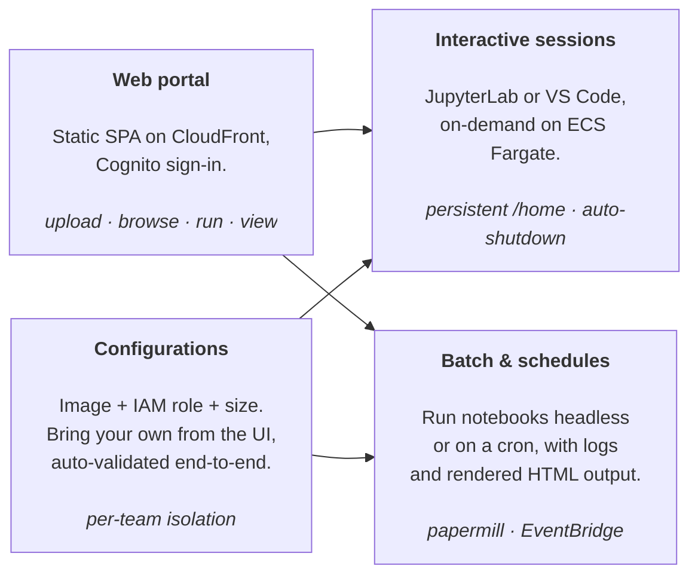

# AWS Serverless Notebook Platform


A self-hosted, browser-accessible notebook platform on AWS. Upload a Jupyter notebook, launch
a JupyterLab or VS Code session on ECS Fargate, run notebooks as one-off batch jobs, schedule
them on a cron — all behind Cognito and CloudFront, all provisioned by one `terraform apply`.



|  |  |
|:---:|:---:|
|  |  |

## What you get

- **Notebooks in the browser, no machine to manage.** Upload `.ipynb` files, organize them in
  folders, view rendered output, all from a portal served via CloudFront. No EC2, no SageMaker,
  no local Python setup — sessions are ECS Fargate tasks that exist only while you use them.
- **Two interactive runtimes, one click.** Pick a configuration, pick CPU/RAM, click Run —
  you get either a full JupyterLab or a full VS Code in the browser, served over HTTPS at a
  per-session URL. Idle sessions are killed automatically (default 60 min) to keep costs flat.
- **Batch + scheduled execution, baked in.** The same notebook you ran interactively can be
  run headless via Papermill, or scheduled on a cron through EventBridge. Output is rendered
  back to HTML and served from the portal; execution history per notebook is one click away.
- **Bring your own image and IAM role.** A *configuration* pairs a Docker image (any ECR repo)
  with an IAM role and default sizing. Add new ones from the UI; the platform automatically
  validates them end-to-end (Papermill hello-world, JupyterLab boot, code-server boot) and
  marks each session type compatible only if its validation passed.
- **Per-user persistent storage.** EFS access points give every user a private `/home`
  preserved across sessions, plus a `/shared` mount for team data. No more "I lost my work
  when the kernel died."
- **Cognito + WAF + private origin out of the box.** Email-based admin-only sign-up, OAuth2
  PKCE, a CloudFront-only path to the ALB (origin verification + AWS-managed prefix list),
  WAF rate-limiting, geo-blocking, IP allowlist, API Gateway throttling.
- **Tag-based safety net for custom configurations.** Custom IAM roles and ECR repos must
  carry a security allowlist tag (`{project_name}:{domain_name} = allowed`) — the stack is
  policy-restricted to refuse everything else, so a mistyped ARN can't grant unintended
  privileges.
- **Multi-environment by default.** `dev`, `staging`, `prod`, … are isolated via Terraform
  workspaces. Resource names embed the workspace; no shared state, no copy-paste.

## How it works

Five concepts cover the platform:

- A **notebook** is an `.ipynb` file you upload through the portal. It lives in S3, is rendered
  to HTML on demand, and can be run interactively, headlessly, or on a schedule.
- A **session** is an ECS Fargate task running JupyterLab or code-server, fronted by an ALB
  listener rule on a per-session path (`/s/{service}/{session_id}/*`) and proxied through
  CloudFront. Idle sessions are reaped automatically.
- An **execution** is a one-off ECS task that runs a notebook with Papermill and renders the
  result. Per-notebook execution history (status + output link) is shown in the UI.
- A **schedule** is an EventBridge Scheduler rule that fires an execution on a cron expression.
- A **configuration** is the (Docker image, IAM role, default size) tuple users pick from when
  launching a session or running a notebook. Configurations are either Terraform-managed
  (seeded from code, immutable in the UI) or user-added through the UI (validated end-to-end
  on creation).

CloudFront fronts everything: the SPA, the API Gateway, and the sessions ALB. The ALB security
group only accepts traffic from the AWS-managed CloudFront origin-facing prefix list, so the
ALB is unreachable from the public internet.

## Quickstart

Prerequisites:

- An AWS account with admin (or close to it) credentials configured locally.
- Terraform `>= 1.0` and Docker (Terraform invokes Docker locally to build images).
- An existing Terraform state backend (S3 bucket + DynamoDB table).
- A VPC tagged `Name = {project_name}_network_platform_prod` with public subnets tagged `Tier = Public`.

Full prerequisites in [`docs/deploying.md`](docs/deploying.md).

```bash
# 1. Clone
git clone https://github.com/erwan-simon/aws-serverless-notebook-platform.git
cd aws-serverless-notebook-platform/iac

# 2. Create your local config from the templates and edit the values
cp backend.hcl.example      backend.hcl
cp terraform.tfvars.example terraform.tfvars
$EDITOR backend.hcl terraform.tfvars

# 3. Deploy
terraform init -backend-config=backend.hcl
terraform workspace new prod
terraform apply

# 4. Get the URL
terraform output cloudfront_url
```

Open the URL in your browser, sign in with the Cognito user you created, upload a notebook
and run it. Full deployment walk-through (including how to create the first Cognito user) in
[`docs/deploying.md`](docs/deploying.md). End-user walk-through in [`docs/using.md`](docs/using.md).

## Concepts at a glance

| Concept             | What it is                                                                                              | Where it lives                              |
|---------------------|---------------------------------------------------------------------------------------------------------|---------------------------------------------|
| **Notebook**        | `.ipynb` file uploaded through the portal. Stored in S3, rendered on demand.                            | S3 + DynamoDB                               |
| **Session**         | On-demand JupyterLab or VS Code task on ECS Fargate, served at `/s/{service}/{id}/*`.                   | ECS service + ALB listener rule             |
| **Execution**       | One-shot Papermill run of a notebook on ECS, with rendered HTML output.                                 | ECS task + DynamoDB                         |
| **Schedule**        | Cron-triggered execution.                                                                               | EventBridge Scheduler                       |
| **Configuration**   | Image + IAM role + default size, picked at run time. Managed (immutable) or user-added (validated).     | DynamoDB                                    |
| **Workspace**       | Terraform workspace = environment (`dev`, `staging`, `prod`, …). Embedded in every resource name.       | Terraform                                   |

Resource names follow `{project_name}_{domain_name}_{workspace}_{resource_name}`, e.g.
`poc_jupyter_sandbox_prod_ecs_cluster`.

## Documentation

| If you want to…                                       | Go to                                       |
|-------------------------------------------------------|---------------------------------------------|
| Stand the platform up in a real AWS account           | [`docs/deploying.md`](docs/deploying.md)    |
| Use the deployed platform (notebooks, sessions, …)    | [`docs/using.md`](docs/using.md)            |

## Repository layout

```
.
├── code/
│   ├── backend/                       # 17 Lambda handlers (Python), grouped by domain
│   │   ├── configuration/             # add, delete, list, update
│   │   ├── notebook/                  # upload, list, delete, render, run, update
│   │   ├── execution/                 # get_status, list, update_status
│   │   ├── session/                   # run, get, stop
│   │   └── schedule/                  # schedule, unschedule
│   ├── frontend/                      # Static SPA (HTML + vanilla JS), Cognito PKCE auth
│   ├── docker_images/default/         # Default base image: jupyter/base-notebook + papermill
│   │                                  #   + uv + jupyterlab-lsp + code-server
│   ├── lambda_cleanup_idle_session/   # EventBridge-triggered idle-session sweeper
│   └── lambda_cleanup_unused_labels/  # Label garbage collector
├── iac/                               # Terraform root module
│   ├── lambda_backend_module/         #   Reusable Lambda + API Gateway integration module
│   ├── backend_*_lambda.tf            #   One file per backend Lambda
│   └── *.tf                           #   CloudFront, WAF, ALB, ECS, Cognito, EFS, …
├── docs/                              # Standalone deployment + usage guides
└── LICENSE                            # CC BY-NC 4.0
```

## License & Contributing

Licensed under [Creative Commons Attribution-NonCommercial 4.0](LICENSE).

The source of truth for development is GitLab; this GitHub repository is a read-only mirror
that runs `semantic-release` on the `prod` branch. Commits must follow
[Conventional Commits](https://www.conventionalcommits.org/) — release versioning is derived
from commit messages.
