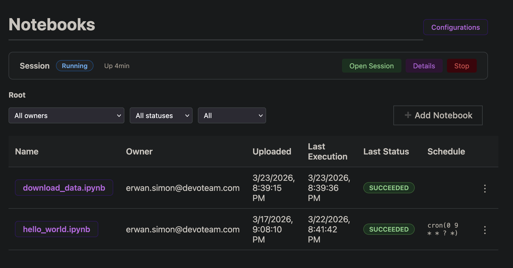
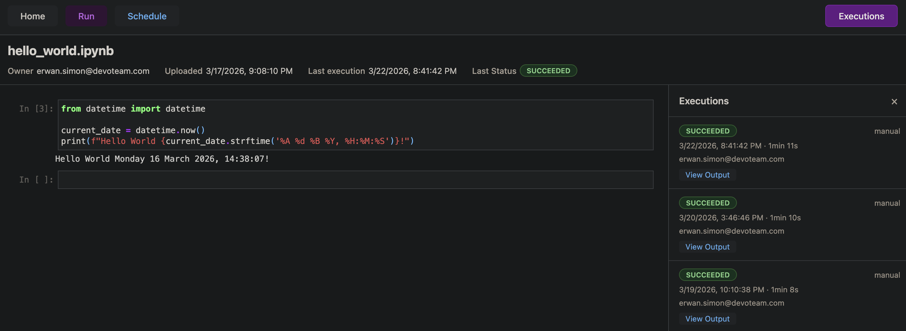
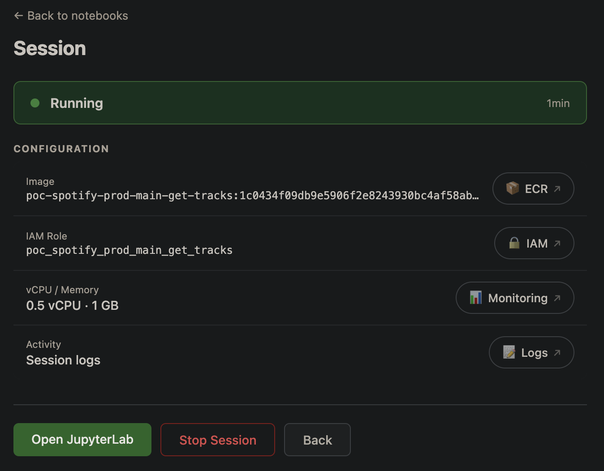
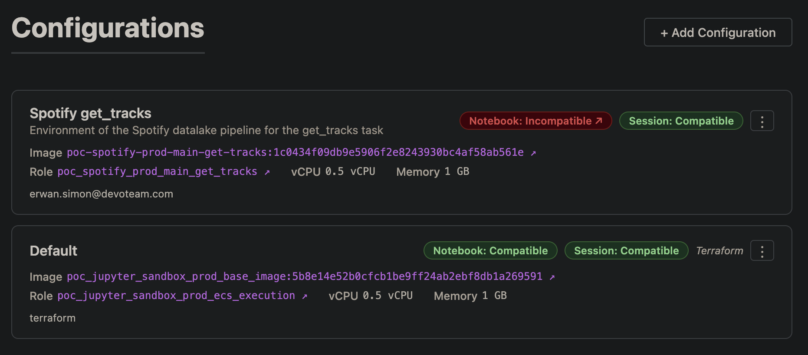

# AWS Serverless Notebook Platform

A self-hosted, serverless platform for managing and executing Jupyter notebooks on AWS. Built entirely with Terraform, it provides a web portal to upload notebooks, launch interactive Jupyter sessions on ECS Fargate, run notebooks as batch jobs, and schedule recurring executions — all behind Cognito authentication and CloudFront.

|  |  |
|:---:|:---:|
|  |  |

## Features

- **Notebook Management** — Upload, organize in folders, delete, and view rendered notebooks
- **Interactive Sessions** — Launch on-demand Jupyter environments on ECS Fargate with configurable CPU/memory
- **Batch Execution** — Run notebooks as one-off ECS tasks with real-time status tracking
- **Scheduling** — Cron-based recurring execution via EventBridge Scheduler
- **Dockerized Environments** — Dependencies managed via Docker images
- **Custom Images & Roles** — Add your own Docker images and IAM roles directly from the UI, with automatic compatibility validation
- **Authentication** — Cognito User Pool with OAuth2 PKCE flow
- **Security** — WAF (rate limiting, geo-blocking, IP whitelist), CloudFront origin verification, API Gateway JWT authorization and throttling
- **Monitoring** — CloudWatch alarms on WAF, Lambda errors, ECS task failures, with SNS email notifications
- **Persistent Storage** — EFS filesystem with per-user and shared space across sessions
- **Multi-environment** — Terraform workspaces for dev/staging/prod isolation

### High-level overview

```
User → WAF → CloudFront ──→ S3 (frontend SPA)
                         └─→ API Gateway (HTTP API, JWT auth)
                              └─→ Lambda functions (17)
                                   ├── DynamoDB (notebooks, executions, configurations)
                                   ├── S3 (notebook files, rendered HTML)
                                   └── ECS Fargate (sessions, batch runs)
                                        └── EFS (persistent storage)

Session traffic:
User → WAF → CloudFront → ALB (/s/{service_name}/*) → ECS task (Jupyter)

EventBridge ──→ Lambda (status sync, session cleanup)
           └──→ SNS (task failure alerts)
CloudWatch Alarms ──→ SNS ──→ Email
EventBridge Scheduler ──→ Lambda (scheduled notebook runs)
```

## Prerequisites

- [Terraform](https://developer.hashicorp.com/terraform/install) >= 1.0
- AWS CLI configured with appropriate credentials
- An AWS account with permissions to create: VPC resources, ECS, Lambda, S3, DynamoDB, CloudFront, WAF, Cognito, EventBridge, SNS, EFS, IAM roles, CloudWatch, API Gateway, ECR, SSM, ALB
- An existing VPC with public subnets tagged `Tier = "Public"` and the VPC tagged with `Name = "{project_name}_network_platform_prod"`
- Docker (for building Lambda and Jupyter container images)

## Project Structure

```
.
├── code/
│   ├── backend/                       # Lambda function handlers (Python)
│   │   ├── configuration/             # Add, delete, list, update configurations
│   │   ├── notebook/                  # Upload, list, delete, render, run notebooks
│   │   ├── execution/                 # Get status, list, update execution status
│   │   ├── session/                   # Run, get, stop sessions
│   │   └── schedule/                  # Schedule, unschedule notebook runs
│   ├── frontend/                      # Static SPA (HTML + vanilla JS)
│   │   ├── index.html                 # Notebook list, upload, run
│   │   ├── notebook.html              # Notebook viewer, run, schedule
│   │   ├── run.html                   # Session launch (config + resources)
│   │   ├── session.html               # Active session view
│   │   ├── executions.html            # Execution history
│   │   ├── configurations.html        # Configuration management (CRUD + validation)
│   │   ├── auth.js                    # Cognito PKCE authentication
│   │   └── config.js.tpl              # Terraform-templated configuration
│   ├── docker_images/default/         # Base Jupyter Docker image
│   └── lambda_cleanup_idle_session/   # Session cleanup Lambda
├── iac/                               # Terraform root module
│   ├── lambda_backend_module/         # Reusable Lambda deployment module
│   ├── sandbox_instance_module/       # Reusable ECS Jupyter instance module
│   ├── backend_*_lambda.tf            # One file per backend Lambda
│   ├── terraform.tfvars               # Variable values
│   └── *.tf                           # Infrastructure definitions
└── LICENSE                            # CC BY-NC 4.0
```

## Deployment

All Terraform commands run from the `iac/` directory:

```bash
cd iac
```

### 1. Configure variables

Edit `terraform.tfvars`:

```hcl
project_name           = "myproject"
git_repository         = "https://github.com/you/your-repo"
alerting_emails        = "you@example.com,team@example.com"
cidr_list_to_whitelist = "1.2.3.4/32,5.6.7.8/32"
```

### 2. Configure the Terraform backend

Edit the `backend "s3"` block in `terraform.tf` with your own S3 bucket, DynamoDB table, and region.

### 3. Initialize and deploy

```bash
terraform init

# Create or select a workspace (workspace = environment name)
terraform workspace new prod
# or
terraform workspace select prod

terraform plan
terraform apply
```

### 4. Access the platform

```bash
# Get the CloudFront URL (main entry point)
terraform output cloudfront_url

# Get the API Gateway URL (direct API access)
terraform output api_gateway_url
```

Open the CloudFront URL in your browser. You will be redirected to Cognito for authentication.

## Configuration

### Terraform Variables

| Variable | Type | Description |
|----------|------|-------------|
| `project_name` | `string` | Project name, used in all resource naming |
| `git_repository` | `string` | Git repository URL (for resource tagging) |
| `alerting_emails` | `string` | Comma-separated emails for SNS alert subscriptions |
| `cidr_list_to_whitelist` | `string` | Comma-separated CIDRs allowed through WAF |
| `role_to_assume_arn` | `string` | (Optional) IAM role ARN to assume for deployment |

### Key Locals

Defined in `iac/locals.tf`:

| Local | Default | Description |
|-------|---------|-------------|
| `session_idle_timeout_minutes` | `60` | Minutes before idle sessions are cleaned up |
| `task_default_vcpu` | `512` | Default vCPU for tasks (512 = 0.5 vCPU) |
| `task_default_memory` | `1024` | Default memory in MB |
| `task_max_vcpu` | `4096` | Max vCPU users can select (4096 = 4 vCPU) |
| `task_max_memory` | `16384` | Max memory users can select (16 GB) |

### Configurations (Docker Image + IAM Role)

Configurations pair a Docker image URI with an IAM role ARN, along with default vCPU/memory. Users select a configuration when launching sessions or running notebooks. If the image URI has no tag or digest (e.g. `123456789.dkr.ecr.eu-west-1.amazonaws.com/my-repo`), the platform automatically resolves it to the most recently pushed tag in the ECR repository at runtime.

**Terraform-managed configurations** are defined in the `MANAGED_CONFIGURATIONS` environment variable of the `list_configurations` Lambda (see `iac/backend_list_configurations_lambda.tf`). They are automatically seeded into DynamoDB and cannot be edited or deleted from the UI.

**Custom configurations** can be added from the UI. When created, two validations are launched automatically:
1. **Notebook validation** — Runs a hello_world notebook with papermill
2. **Session validation** — Starts JupyterLab and health-checks the API endpoint

Configurations that fail validation are filtered from the relevant dropdowns (e.g. a config that fails session validation won't appear in the session launch dropdown).

### Adding Terraform-managed Configurations

Edit the `MANAGED_CONFIGURATIONS` env var in `iac/backend_list_configurations_lambda.tf`:

```hcl
MANAGED_CONFIGURATIONS = jsonencode([
  {
    id            = "default"
    name          = "Default"
    ecr_image_uri = "${module.build_default_configuration_image.ecr_url}:${local.image_tag}"
    iam_role_arn  = aws_iam_role.default_configuration.arn
    vcpu          = local.task_default_vcpu
    memory        = local.task_default_memory
  },
  {
    id            = "my-custom"
    name          = "My Custom Image"
    ecr_image_uri = "123456789.dkr.ecr.eu-west-1.amazonaws.com/my-image:latest"
    iam_role_arn  = aws_iam_role.my_custom_role.arn
    vcpu          = 1024
    memory        = 2048
  },
])
```

Custom IAM roles **must**:
- Have a trust policy allowing `ecs-tasks.amazonaws.com` to assume the role
- Have permission to pull the Docker image from ECR
- Have permission to write CloudWatch logs
- **Carry the security allowlist tag** `{project_name}:{domain_name} = allowed` (see the Security section). The stack is policy-restricted to only pass roles carrying this tag.

Refer to `iac/iam_role_default_configuration.tf` for a working example.

Custom ECR repositories referenced from a configuration must also carry the `{project_name}:{domain_name} = allowed` tag — the ECS execution role is policy-restricted to pull only from tagged repositories.

## Base Docker Image

The default Jupyter image is built from `code/docker_images/default/Dockerfile`:

- **Base**: `jupyter/base-notebook:x86_64-ubuntu-22.04`
- **System packages**: awscli, curl
- **Python tools**: papermill, uv, jupyterlab-lsp, jedi-language-server
- **Default kernel**: Python with awswrangler, ipykernel (installed via uv in a dedicated venv)

The image tag is a SHA1 hash of the build context, so any file change triggers a rebuild on `terraform apply`.

## API Endpoints

All routes require Cognito JWT authentication and are proxied through CloudFront.

### Notebooks

| Method | Route | Description |
|--------|-------|-------------|
| `GET` | `/api/notebooks` | List all notebooks |
| `POST` | `/api/notebooks` | Upload a notebook |
| `DELETE` | `/api/notebooks/{id}` | Delete a notebook |
| `GET` | `/api/notebooks/render` | Render notebook to HTML |
| `GET` | `/api/notebooks/{notebook_id}/executions` | List executions for a notebook |
| `POST` | `/api/notebooks/{id}/schedule` | Schedule recurring execution |
| `DELETE` | `/api/notebooks/{id}/schedule` | Remove schedule |

### Executions

| Method | Route | Description |
|--------|-------|-------------|
| `POST` | `/api/executions` | Run a notebook |
| `GET` | `/api/executions/{execution_id}/status` | Get execution status |

### Sessions

| Method | Route | Description |
|--------|-------|-------------|
| `POST` | `/api/sessions` | Launch a Jupyter session |
| `GET` | `/api/sessions/me` | Get current user's session |
| `DELETE` | `/api/sessions/{service_name}` | Stop a session |

### Configurations

| Method | Route | Description |
|--------|-------|-------------|
| `GET` | `/api/configurations` | List all configurations (seeds managed configs, launches missing validations) |
| `POST` | `/api/configurations` | Add a custom configuration (launches dual validation) |
| `PATCH` | `/api/configurations/{id}` | Update a configuration (clears and re-launches validations) |
| `DELETE` | `/api/configurations/{id}` | Delete a custom configuration |

## Security

### Network

- **WAF v2** (CloudFront + ALB) — Rate limiting, geo-blocking (configurable), IP whitelist
- **CloudFront origin verification** — Random secret in SSM Parameter Store, injected as custom header by CloudFront, verified by every Lambda
- **API Gateway throttling** — 10 burst / 5 rate globally, 3 burst / 1 rate for expensive operations (session launch, notebook run)
- **ALB** — Routes session traffic (`/s/{service_name}/*`) to the correct ECS task

### Authentication & Authorization

- **Cognito User Pool** — Email-based accounts, admin-only creation, OAuth2 PKCE flow
- **JWT validation** — API Gateway JWT authorizer validates tokens on every request
- **IAM roles** — Granular per-function Lambda roles, configurable ECS task execution roles
- **Tag-based allowlist for roles and ECR repos** — The `run_notebook` / `run_session` Lambdas can only `iam:PassRole` on IAM roles tagged `{project_name}:{domain_name} = allowed`, and the ECS execution role can only pull ECR images from repositories carrying the same tag. Users creating a custom configuration must reference a role and a repository tagged accordingly; `add_configuration` / `update_configuration` pre-validate the tags and reject the request with a clear error otherwise. Defined in `iac/locals.tf` as `security_tag_key` / `security_tag_value`.

### Data

- **S3** — Server-side encryption (AES-256), public access blocked
- **DynamoDB** — Pay-per-request billing, no public access
- **EFS** — Mounted only within VPC, per-user access points

## Monitoring & Alerting

| Alert | Trigger | Destination |
|-------|---------|-------------|
| WAF blocked requests | > 50 blocked in 5 min | SNS (us-east-1) |
| Lambda errors | Any error (per function) | SNS (eu-west-1) |
| ECS task failure | Non-zero exit code, TaskFailedToStart | SNS (eu-west-1) |

All alerts are sent to email addresses configured in `alerting_emails`. SNS topics exist in two regions because WAF/CloudFront metrics are only available in us-east-1.

CloudWatch logs are collected for:
- All Lambda functions (14-day retention)
- API Gateway access logs (14-day retention)
- ECS cluster (Container Insights enhanced mode)

## Resource Naming Convention

All resources follow the pattern:

```
{project_name}_{domain_name}_{workspace}_{resource_name}
```

Example: `poc_jupyter_sandbox_prod_ecs_cluster`

The Terraform workspace maps to the environment/stage name.

## License

This project is licensed under the [Creative Commons Attribution-NonCommercial 4.0 International](LICENSE) license (CC BY-NC 4.0).
